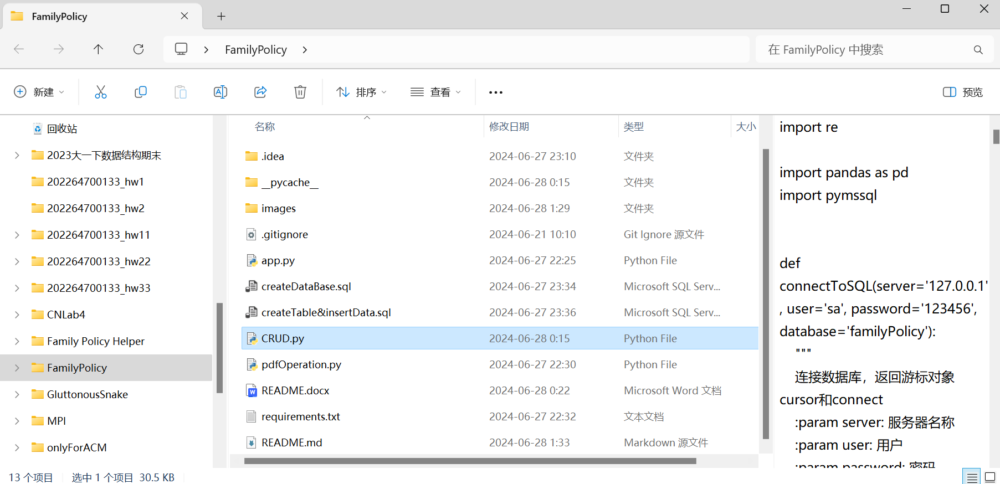
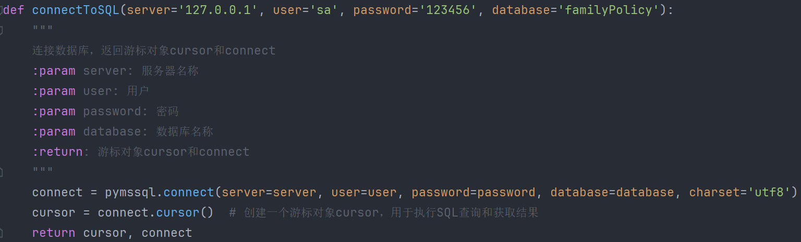
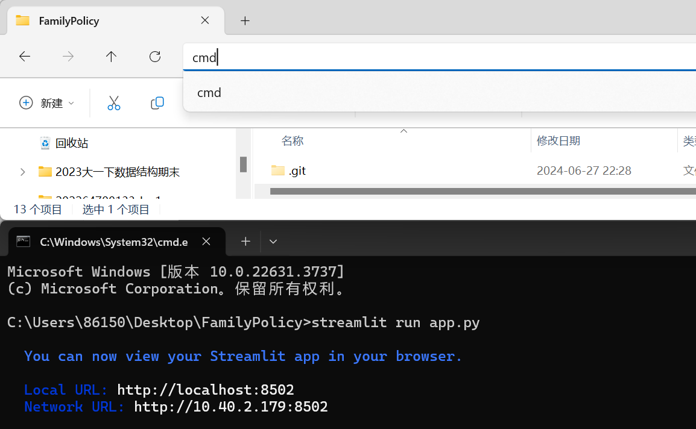

<h1 style="text-align: center;">家庭保单小管家</h1>

<h2 style="text-align: center;">小组编号：5</h2>

<h2 style="text-align: center;">小组成员：张正烨，牛熙皓，王上，曾嘉</h2>


## 1、初始化数据库

使用SQL Server数据库：

运行脚本 `createTable&insertData.sql` 创建表格并插入数据。

## 2、安装必要的Python软件包

确保安装以下Python软件包：
- `pandas`
- `pymssql`
- `reportlab`
- `streamlit`
```sh
pip install -i https://pypi.tuna.tsinghua.edu.cn/simple pandas pymssql reportlab streamlit
```
```sh
pip install -i https://pypi.tuna.tsinghua.edu.cn/simple -r requirements.txt
```

## 3、修改连接数据库的函数

修改该函数的各参数以连接数据库，该函数位于CRUD文件里。
<div style="text-align: center;">
    
</div>
<div style="text-align: center;">
    
</div>

## 4、运行项目

1. 在命令提示符里进入项目所在目录
2. 执行命令：
```sh
streamlit run app.py
```
<div style="text-align: center;">
    
</div>